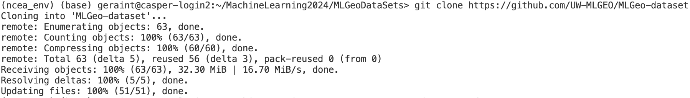

# Machine Learning for Earth Science 2024

[Geraint Webb's](https://github.com/UW-MLGEO/MLGEO2024_geraintwebb) Machine Learning for Earth Science 2024 repository. 

## Installation

Follow these steps to install:

```bash
# Clone the repository
git clone https://github.com/UW-MLGEO/MLGEO2024_geraintwebb
```
Here is a screenshot of what the cloning should look like (note this was for the dataset repo. since I had already cloned this but the process is the same)



```bash
# Navigate to the repository
cd MLGEO2024_geraintwebb

# Create and activate the conda environment
conda env create -f environment.yml
conda activate mlgeo2024
```

## Running the Notebook

To run a Jupyter notebook one could use the terminal command and then choose their notebook:

```bash
jupyter notebook
```
However, we use VS Code and open it within the application using a remote keernal to execute the Juypter Hub.


## Favorite Earth Science Topics

- Climate Change
- Sea Ice
- Tidal Glaciers
- Ice Sheets

## Evidence of add, commit, push

[PDF](./Screenshots/example.pdf)

## License

This project is licensed under the MIT License, which allows for open-source use and distribution. This is important so that the code remains free and not locked behind a paywall.